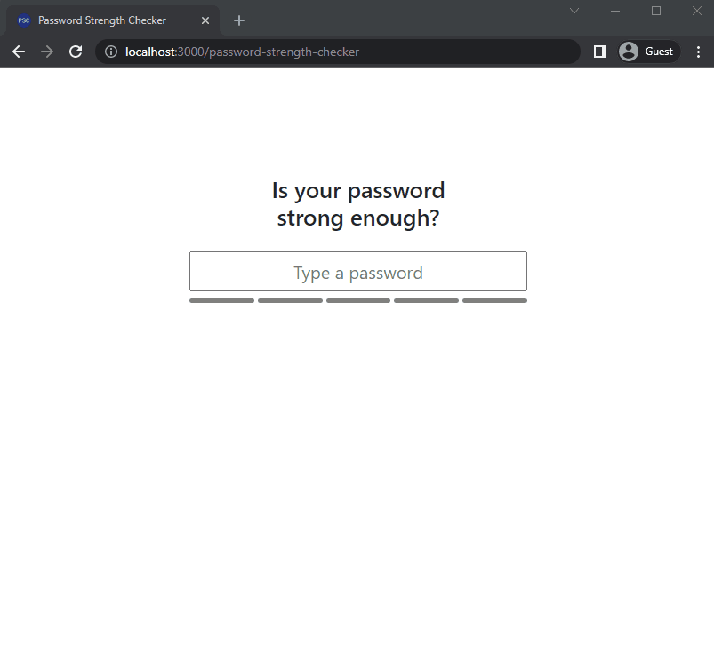

# Password Strength Checker

_A simple app to measure your passwords' strength_

### Quick Start

Install [Git](https://git-scm.com/downloads) on your machine and clone this repo.

`git clone https://github.com/valmoresron/password-strength-checker.git`

There are three ways to run this app - [Node.js](#running-using-node-js), [Docker](#running-using-docker), or [Docker Compose](#running-using-docker-compose)

#### Running using **Node.js**

- Make sure your machine has **Node.js 16.14.0** or a later version. You can download it [here](https://nodejs.org/en/download/).
- Navigate to the project directory and run the following commands:
  - Install all dependencies by running `npm install`
  - Start the app using `npm start`
- Once it is running, you can access the app by going to [localhost:3000](http://localhost:3000) on your browser.

#### Running using **Docker**

- Make sure your your machine has Docker installed. You can follow the guide [here](https://docs.docker.com/get-docker/).
- Navigate to the project directory and run the following commands:
  - Build the container by running `docker build -t password-strength-checker:dev .`
  - Start the container using `docker run-it --rm -p 3000:3000 -v ${PWD}:/app -v /app/node_modules -e CHOKIDAR_USEPOLLING=true password-strength-checker:dev`
- Once it is running, you can access the app by going to [localhost:3000](http://localhost:3000) on your browser.

#### Running using **Docker Compose**

- Make sure you have installed **Docker Compose** on your machine. You can follow the guide here [here](https://docs.docker.com/compose/install/).
- Navigate to the project directory and run the following commands:
  - Build the container by running `docker-compose build`
  - Start the container using `docker-compose up`
- Once it is running, you can access the app by going to [localhost:3000](http://localhost:3000) on your browser.
